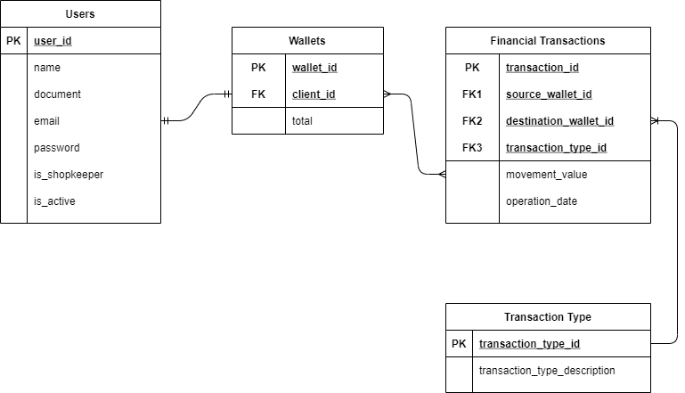
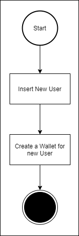
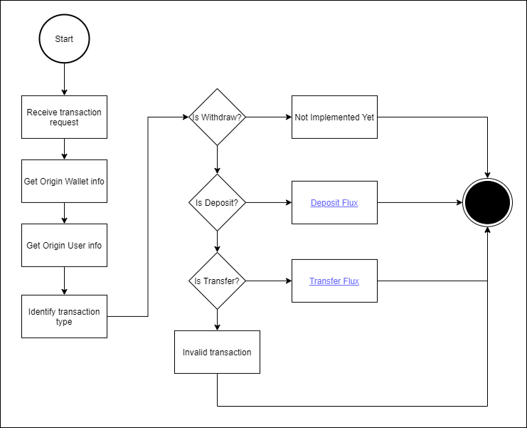
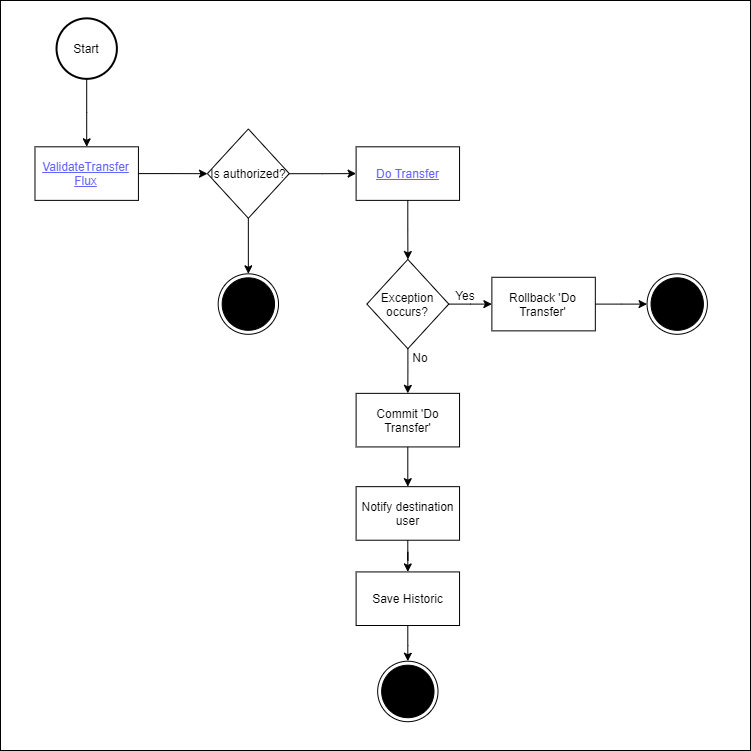
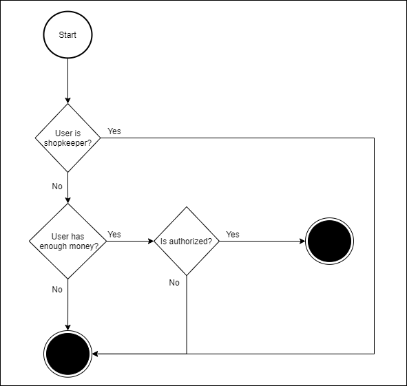
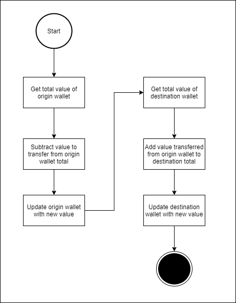
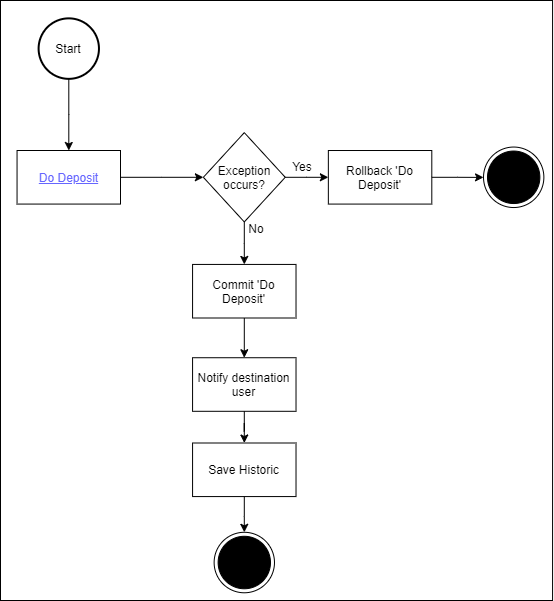
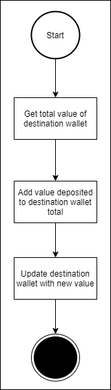

# Project technologies
- Python (framework: fastApi)
- MySql (python package: mysql-connector-python)
---
# How to start the project
Using docker you can run the following command on project root folder:
> docker compose up -d

Docker compose will start 2 pods:
- One Pod containing the WalletApi
- One Pod containing the MySql DB
---
# Documentation
On 'docs' folder exist two folder:
- One called "database", containing a .sql file with a script creating the database,
  tables and inserting some dummy records. This file run the first time the database is created with the docker compose 
  command mentioned before.
- One called 'wallet_api_flux', with a draw.io containing all fluxes that are above.
- One called 'images' with all the images bellow.
---
# Project DER
> This project consist of 4 tables and that is how they relate.
> 
> 

---

### Create User Flux
> 
 

----
Here we have all fluxes under the transaction endpoint for wallets.
> If you prefer open the 'walletAPI.drawio' that can be found in 'docs/wallet_api_flux' folder in draw.io

#### Transaction Flux
> 
#### TransferFlux
> 
#### Validate Transfer
> 
#### Do Transfer
> 
#### DepositFlux
> 
#### Do Deposit
> 
 
